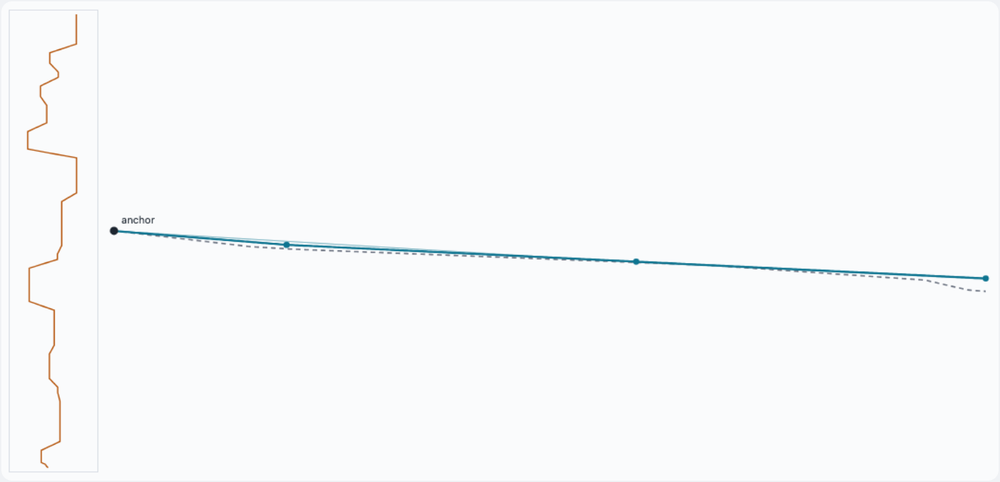

# The segment-beam decoder

*Wellbore geosteering · trajectory decoding · a working engineer's tutorial*

A beam search whose moves are not single steps but **strides** — straight segments, 120 to 1,280
rows long — walking a geometric hypothesis from the anchor to the far end of the well. This page
covers the state space, the bucket lattice, the arithmetic of who competes with whom, and a
sandbox to experiment in.

This is the component the [solution reference](../solution-reference.md) calls *"beam search,
gamma ray against the reference log"* — the third-largest weight in the blend at .1479, plus a
variant with a trend override at .0395. In the code it is `modules/stride_defs.py`. Everything
below is drawn from that production source and this project's measured results; all parameters and
numbers are the real ones.

**Contents.** [1 S-space and the anchor](#1-setting-s-space-and-the-anchor) · [2 The
state](#2-the-state-is-a-hypothesis-not-a-position) · [3 The proposal menu](#3-the-proposal-menu)
· [4 Scoring a segment](#4-scoring-a-segment) · [5 Buckets](#5-buckets-the-position-lattice) · [6
Tree growth](#6-tree-growth-not-cross-products) · [7 A numeric
walk](#7-a-numeric-walk-from-the-anchor) · [8 Sandbox](#8-sandbox) · [9 The corridor
end](#9-the-corridor-end--final-selection) · [10 The mod-60
lanes](#10-field-note-the-mod-60-lanes) · [11 Versus the row
aligner](#11-segment-beam-versus-the-row-level-aligner) · [12 Check your
understanding](#12-check-your-understanding)

## 1 Setting: S-space and the anchor

A horizontal well logs gamma ray (GR) along its measured depth. A nearby vertical **typewell**
provides the reference barcode `(TVT, GR)` — GR as a function of position in the layer stack. For
the surveyed first stretch of the well, TVT is known; the last known point is the **anchor**. The
task: predict TVT for every row after the anchor — the stretch this page calls the **corridor**.

The decoder works in **S-space**: `S = TVT + Z`, where Z is the borehole's true vertical depth. S
is the elevation of the geological datum at the bit's map position — a property of the *rock*, not
of the well path. Geology is locally planar, so S changes smoothly and near-linearly along the
lateral. That single change of variable is what makes straight-line segments a sensible hypothesis
language:

```text
hypothesis: S(md) is piecewise LINEAR in measured depth
prediction: TVT(md) = S(md) − Z(md) (Z is known from the survey)
```

A straight segment in S is *not* straight in TVT — it bends with the borehole's own vertical
motion. One especially meaningful slope exists per stretch of borehole: the slope equal to the
local Z-slope, which makes TVT *constant* — the bit riding a single bed. That hypothesis gets its
own proposal family (Section 3).

## 2 The state is a hypothesis, not a position

A row-level gamma-ray aligner — the obvious alternative, and the design this one is contrasted
with in section 11 — has states that are bare positions. This decoder's state is heavier:

```text
State = ( pos        corridor row where my last segment ended
        , S          where I am in S
        , slope      my last segment's slope          <- momentum
        , family     which proposal family produced my last segment
        , cost       accumulated negative log-likelihood since the anchor
        , segments   my full history, for reconstruction )
```

The slope in the state is the crucial entry: it lets the scoring say *"trajectories have
momentum"* (a persistence penalty compares each new slope to the parent's). A consequence with
teeth: two hypotheses at the same `pos` and same `S` but different slopes are **not
interchangeable** — their futures cost differently. So unlike a row-level aligner, this decoder
cannot merge paths that meet; the search is a growing *tree*, tamed only by pruning.

The decode starts from a single seed: `pos 0, S = anchor TVT + anchor Z, slope = trend`, where the
**trend** is a robust slope fitted on the last ~200 known rows of this well (clipped to ±0.12
ft/ft).

## 3 The proposal menu

Each surviving state proposes its next segment as a *combination* of a length and a slope:

### Seven lengths

`120, 240, 360, 540, 720, 960, 1280` rows — a roughly geometric ladder (at ~2 ft of measured depth
per row, from ~240 ft to over half a mile). These are *alternative strides* proposed
simultaneously, not a division of the corridor: the corridor gets segmented differently by every
hypothesis.

### Two slope families

| family | candidates (cap) | built from | meaning |
|---|---|---|---|
| slope_s | ≤ 17 | 9 fixed base slopes (−0.08…+0.08) ∪ trend ± {0, .015, .025, .04} ∪ parent-slope ± {0, .015, .025, .04} | "keep drifting like the well drifts" — absolute safety net + relative refinement |
| flat_tvt | ≤ 11 | local Z-slope ± {0, .005, .01, .02, .03} — computed from this well's trajectory over this exact candidate segment | "ride the bed" — TVT stays (nearly) constant |

> **Not a fixed grid.** Only the 9 base slopes are identical across wells. The rest is anchored to
> well-specific quantities: the heel trend (per well), the parent's slope (per hypothesis!), the
> borehole geometry (per well, per position, per candidate length). Deep in the corridor, two
> hypotheses in the same bucket propose *different* slope sets. The proposal distribution is dense
> near what is currently plausible and sparse elsewhere — the same "relative beats absolute"
> principle that runs through this whole problem.

Arithmetic: one parent × 7 lengths × (≤17 + ≤11) slopes ≈ up to **196 children** per expansion.

## 4 Scoring a segment

A candidate segment is a straight line in S from the parent's endpoint. Its cost has one evidence
term and four priors:

```text
EVIDENCE   sampled every 18th row along the segment, at most 160 points
             TVT      = S(md) - Z(md)          -> look up typewell GR at that TVT
             d        = (observed GR - typewell GR) / gr_scale
             gr_loss  = mean( log1p(d^2) )     <- robust: outliers saturate
           contribution:  W_GR * gr_loss * n_scored_rows

PRIORS     bounds         leaving the typewell's TVT range      W = 0.35
           persistence    ((slope - parent_slope)/0.035)^2      W = 2.00   <- momentum
           trend          ((slope - well_trend)/0.070)^2        W = 0.18
           length         (log(len/540)/0.85)^2                 W = 0.15
           family switch  changing proposal family              W = 0      (off in production)
```

Two design choices worth noticing. The *robust* GR loss (`log1p(d²)`) means one bad bed can't veto
a segment — mismatch saturates. And the persistence weight (2.0) towers over the trend weight
(0.18): the model believes momentum locally and the regional trend only loosely. A child's total
cost = parent's cost + this segment's cost. Cumulative cost *is* the negative log-likelihood of
the whole trajectory from the anchor.

## 5 Buckets: the position lattice

Children are filed into **buckets** keyed by where their segment *ends*. The seed's children land
in seven buckets: 120, 240, 360, 540, 720, 960, 1280. But buckets proliferate: survivors at 120
spawn buckets at 240, 360, 480, 660, 840, 1080, 1400; survivors at 240 add 600, 780, 1200… Every
position that is a *sum of menu lengths* eventually hosts one.

The sweep visits positions 0…n in order. At each existing bucket:

- **Prune** to 24 (the beam width) — with a diversity floor first: the best 10 per family are
  guaranteed consideration, then global cost ranking fills the 24. (Buckets are also trimmed
  opportunistically whenever they exceed 4×24 = 96 states.)

- **Expand**: each of the 24 survivors generates its ≤196 children into buckets downstream.

The general arrival rule: *a bucket at position P receives children from every existing bucket at
P−L, for each menu length L*. Each contributor sends at most 24 parents × ~28 same-length children
≈ 670 arrivals.

## 6 Tree growth, not cross-products

A tempting misreading: "24 states at 120, 24 slopes at 240 — so 24 × 24 combinations?" No — and
the reason is load-bearing. A child is created *by* a specific parent and is meaningless without
it: the child's starting S is *that parent's* endpoint, and its persistence penalty compares to
*that parent's* slope. A slope proposal is never recombined with any other parent. What a bucket
holds is complete trajectories-so-far, each with one definite lineage:

```text
bucket 240, at sweep time:
~670 trajectories: anchor ─(some 0–120 segment)─ 120 ─(some 120–240 segment)─ 240
~ 25 trajectories: anchor ─(one straight 0–240 segment)────────────────────── 240
→ all ranked together by cumulative cost → best 10/family floor → keep 24
```

Hypotheses with different segmentation rhythms compete head-to-head on total log-likelihood alone.
And because the state includes slope and history, *nothing merges* — the beam's 24 slots at each
position are the only thing standing between the tree and exponential growth.

## 7 A numeric walk from the anchor

| sweep at | bucket holds | arrivals | then |
|---|---|---|---|
| 0 | the seed (S = anchor, slope = trend) | 1 | expands: ~25 children per length × 7 lengths → 7 buckets |
| 120 | seed's L=120 children | ~25 | prune 24 → expand → children at 240, 360, 480, 660, 840, 1080, 1400 |
| 240 | seed's L=240 (~25) + 120-survivors' L=120 (24 × ~28) | ~695 | prune 24 → expand |
| 360 | seed L=360 + 120's L=240 + 240's L=120 | ~1,365 | prune 24 → expand |
| ⋮ | typical mid-corridor bucket: up to 7 contributors | ~2–4,000 | prune 24 → expand |

By mid-corridor a surviving hypothesis is typically 3–9 segments deep. The exponential space of
all (length, slope) sequences is never enumerated — at every reachable position it is cut back to
the 24 best explanations of everything since the anchor.

## 8 Sandbox

A scaled-down version of the decoder: a synthetic barcode (left strip), a lateral that drifts
through it, segment menu {40, 80, 160, 240} rows, both proposal families, persistence + trend +
length priors, per-bucket beam pruning. Dots mark the segment boundaries of the winning
hypothesis; thin lines are the other finalists that reached the end — the runners-up a production
variant averages over.



*A single run at the production-like settings: beam width 24, persistence 20, trend pull 2, noise
8. Plotted are the true trajectory, the selected hypothesis with dots at its segment ends, the
   other finalists, and the gamma-ray barcode down the left.*

> **This sandbox is interactive on the [rendered
> page](https://monim343.github.io/ml-competition-work/explainers/beam-decoder-field-guide.html#sandbox),
> where the four settings below are sliders and the well can be regenerated.** The image above is
> a single frame of it. The experiments are described here so the reasoning survives in either
> version.

Four experiments, in order:

- **Beam width 1** — greedy segment choice. A single early wrong stride poisons everything after
  it.
  Raising the width from there finds the recovery threshold.

- **Persistence to 0** — slopes become free agents and the path zigzags to chase noise.
  Persistence
  to 60 — the first slope choice becomes destiny. The production value of 20 sits between those two
  failures: momentum is real but not absolute.

- **Trend pull high** — every hypothesis is dragged toward the heel trend even where the barcode
  disagrees. Wells whose true drift changes mid-corridor suffer most.

- **Finalists shown, noise raised** — the spread of the finalists is the honest uncertainty
  statement, and it fans out over flat stretches of barcode where the evidence cannot discriminate.

## 9 The corridor end & final selection

Three things are special at the end of the corridor:

- **Truncation**: proposals overshooting row n are clipped to n and scored on what remains.

- **Snap**: a segment that would end within ~54 rows of n (0.45 × the shortest menu length) is
  stretched to n — no beam capacity wasted on meaningless tail stubs.

- **Selection**: states at n stop. The terminal bucket — a mix of every segmentation rhythm and
  family lineage — is pruned to 24 finalists, and the single cheapest becomes the prediction. This
  is the only prune-to-1 in the algorithm.

Measured perspective on that last step: across all 773 training wells, the truth-best of the 24
finalists beats the cost-best by only ~0.045 pooled RMSE. Final selection is nearly a solved
problem — **when the decoder fails, the truth fell out of the beam far upstream**, not at the
finish line. That's why production also runs a doubled variant (beam 48, family floor 20) and
averages the two decoders: width upstream, not cleverness at the end.

## 10 Field note: the mod-60 lanes

> **A discovered quirk, not a design.** Six menu lengths are multiples of 60 — but 1280 is not.
> Since bucket positions are sums of lengths, the lattice splits into residue classes mod 60:
> histories containing one 1280-stride live at positions ≡ 20 (mod 60), two of them at ≡ 40, none
> at ≡ 0. The classes never share a bucket mid-corridor (they first re-merge after three 1280s, at
> 3840 — or at the corridor end, where truncation and snap put everyone in the terminal bucket).

Concretely: bucket 1280 contains *only* the seed's single-segment children — the "one long
straight shot" family runs in a protected lane, never competing against the multi-segment
population until the very end. Is that bad? Not obviously: it is accidental *diversity
preservation*, structurally similar to the deliberate per-family quota — a lineage that would lose
every local comparison survives to make its case globally. The mild length prior keeps the lane
small. Replacing 1280 with 1260 or 1320 would restore full mixing; whether that helps is an
empirical question, and the production config stays frozen on measured performance, not on lattice
aesthetics.

## 11 Segment-beam versus the row-level aligner

| | row-level GR aligner | this decoder |
|---|---|---|
| state | typewell index (a position) | position + S + slope + family + history |
| one move | 1 row, index step d ∈ [−2, 2] | a straight 120–1280-row segment |
| motion model | move cost mc·\|d\| | persistence + trend + length priors |
| paths that meet | merge (Markov in position) | never merge (state too rich) |
| beam | 8–20 | 24, with a 10-per-family floor (variant: 48/20) |
| evidence | every row, squared error | every 18th row, robust log-loss |
| output | 7 diverse paths → features for a GBM | a trajectory member of the final blend |

The design lesson, stated once and worth repeating: *choose the state so the physics you believe
in is expressible.* A row-level aligner cannot say "trajectories have momentum" — its state has no
slope. This one can. The price is a state too rich to merge, hence a pure tree search where the
beam width and the family floor carry the entire burden of keeping the truth alive.

## 12 Check your understanding

Answers are collapsed — try each one first.

<details>
<summary><b>1. Why can't the decoder merge two hypotheses that arrive at the same position with the same S?</b></summary>

Their futures are not exchangeable: the persistence penalty of every future segment depends on the
arriving slope, and proposal sets themselves are built around the parent's slope. Cheapest-now
does not imply cheapest-onward, which is precisely the condition merging needs (the Markov
property). A row-level aligner's bare-position state satisfies it; this richer state does not.

</details>

<details>
<summary><b>2. Bucket 480 — who delivers children to it, and roughly how many?</b></summary>

Contributors are buckets at 480 − L: 360 (L=120), 240 (L=240), 120 (L=360) — position 0 would need
L=480, which is not on the menu, and 480−540 < 0. Three contributors × up to 24 parents × ~28
same-length children ≈ **~2,000 arrivals**, pruned to 24.

</details>

<details>
<summary><b>3. Why is the flat_tvt family recomputed per candidate segment instead of using fixed slopes?</b></summary>

Because "TVT constant" is not a fixed slope in S — it means dS/dmd equals the borehole's own
dZ/dmd, which changes along the well. The family computes the local Z-slope over the exact rows of
each proposed segment and brackets it. A fixed grid could not express "ride the bed" at all
positions.

</details>

<details>
<summary><b>4. Picking the best of the 24 finalists in hindsight is only ~0.045 better than the one the cost function picks. What does that tell you to work on — and what not?</b></summary>

Not final selection: even a perfect selector recovers almost nothing. The losses happen upstream,
where the truth's lineage gets pruned out of some mid-corridor bucket. Levers that act there: beam
width, family floors, proposal diversity (protected lanes!), and better evidence. This is the
measured justification for the doubled 48/20 variant.

</details>

<details>
<summary><b>5. In the sandbox, why do the finalists agree at the start and fan out toward the toe — even with a wide beam?</b></summary>

All finalists share the anchor (a hard constraint), and evidence accumulates from that end — early
segments are pinned by both the anchor and the data. Toward the toe, hypotheses have had more
segments' worth of freedom, and less downstream evidence exists to discriminate them; uncertainty
grows monotonically with distance from the anchor. The fan *is* the information structure of the
problem, the same asymmetry that makes sweep direction matter for any pruned search.

</details>

Sources: the production module `stride_defs.py` (state, proposal families, cost weights, prune
quotas, snap rules) and this project's measured results — the 773-well gap study of section 9 and
the lattice analysis of section 10.
