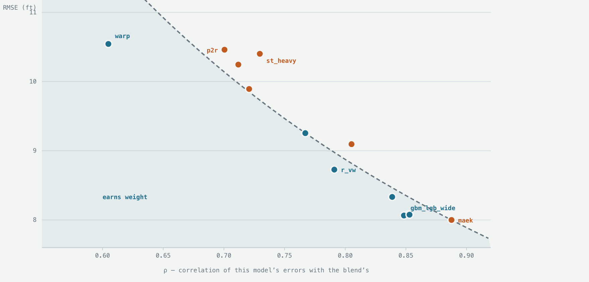
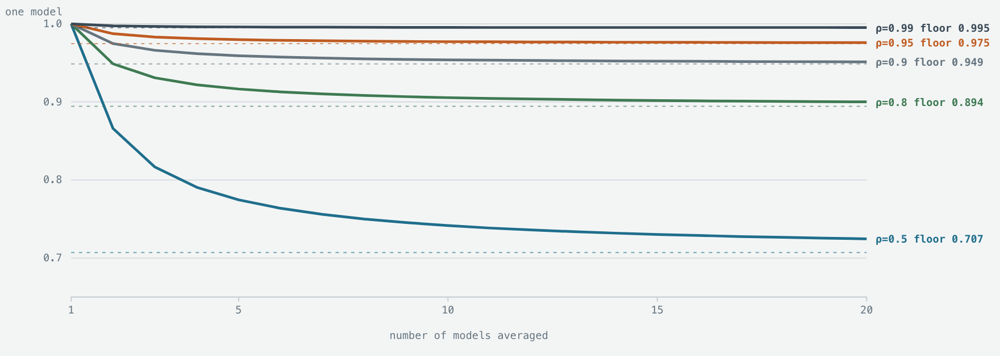
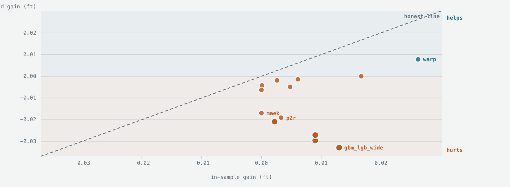
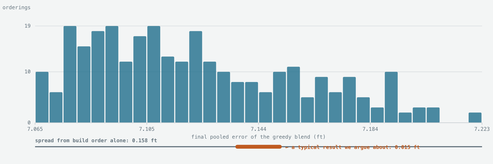

# Does this model help?

*Ensembling · a decision procedure and its failure modes*

For squared error there is an exact answer to "should I add this model?", it takes two numbers,
and it is not the number usually reached for. Then there are four ways it still misleads —
including one that moves the score ten times more than the effects being chased.

> **A note on scope.** This was written mid-competition, when the blend held **nine** members; the
> final submission has thirteen. Two things follow. The whole-well net here is the *original*
> architecture, which the cost-volume net later displaced — in the shipped pipeline it is still
> executed but carries weight zero. And every member is scored on the rows where *all* members of
> that nine-model set have a prediction, so changing the set changes the row intersection and with
> it every pooled number. That is why the standalone figures below do not match the final table in
> [the solution reference](../solution-reference.md): different rows, not different measurements.
> The numbers are left as they were measured; the reasoning is what carried forward.

## Two numbers, one product

Take a working blend and a new candidate. Write `e_b` for the blend's error on each row and `e_i`
for the candidate's. Mix them at weight `w` and the mean squared error is:

```text
V(w) = (1−w)²·A  +  2w(1−w)·B  +  w²·C

     A = mean(e_b²)        B = mean(e_i · e_b)        C = mean(e_i²)

dV/dw at w = 0  =  2(B − A)
```

So the candidate is worth a nonzero weight exactly when **B < A**. Substituting `B = ρ·√(AC)` —
where ρ is the correlation between the two error series — that condition becomes:

> **RMSE_candidate × ρ_candidate  <  RMSE_blend**

Two properties, multiplied. Accuracy alone tells you nothing; correlation alone tells you nothing.
A model can be far worse than the blend and still be worth adding, provided it is wrong in a
sufficiently different way.

**Why this is exact, not a local approximation.** `V(w)` is a quadratic in `w` with leading
coefficient `A − 2B + C = mean((e_b − e_i)²) ≥ 0`, so it is convex. If the derivative at zero is
non-negative, *no* positive weight helps — not merely no small one. And if two candidates each
fail, their average fails too, since its gradient is the average of theirs. The test composes.

When it passes, the same algebra gives the best weight and the gain to expect:

```text
w*  = (A−B) / (A−2B+C)              variance removed = (A−B)² / (A−2B+C)
```

> **One detail that silently breaks this.** ρ here is the **uncentered** cosine `B/√(AC)`, not
> Pearson correlation. The two differ whenever the errors have nonzero mean — which is precisely
> the case for a biased member. Reaching for `np.corrcoef` gives a number that looks right and
> answers a different question.

## The worst model was the most valuable one

Two real members of the blend. They have almost the same standalone error, and they are the two
*worst* models in it. The test sends them opposite ways.

| member | RMSE | ρ | RMSE×ρ | vs the bar, 7.1007 | verdict |
|---|---:|---:|---:|---:|---|
| original whole-well net | 10.5443 | 0.6048 | 6.3775 | −0.723 | add, w* = 0.072 |
| beam search | 10.4024 | 0.7296 | 7.5899 | +0.489 | reject, w* < 0 |

Two models within 0.14 ft of each other on accuracy: one is the single most valuable member in the
ensemble, the other earns nothing. The entire difference is ρ. Sorting candidates by accuracy
would have ranked these two as interchangeable.

Now the whole field — every candidate measured, plotted as accuracy against correlation. The curve
is the decision boundary `RMSE × ρ = 7.1007`; anything below and left of it earns weight.



*Every real candidate against the break-even curve. The boundary is a **hyperbola**, not a line.
Near ρ = 1 no amount of accuracy earns weight; near ρ = 0.6 a model can be **50% worse** than the
blend and still be the best available addition.*

## Ten models at 95% correlation are worth 1.05 models

Take `n` models of equal quality, each pair correlated ρ, and simply average them. The variance of
the average is exactly:

```text
Var(mean) / σ²  =  [ 1 + (n−1)ρ ] / n   →   ρ   as n → ∞
```

Two consequences follow immediately.

**There is a floor, and it is √ρ.** No number of models at 95% correlation can beat √0.95 = 0.9747
— a 2.5% improvement, ever, with infinitely many models.

**The effective count is n / [1 + (n−1)ρ].** At ρ = 0.95 and n = 10 that is **1.05**. Ten models
have the variance-reducing power of one model and a twentieth. The ceiling as n → ∞ is 1/ρ =
1.053, so the eleventh, hundredth and thousandth model buy essentially nothing.



*Error of an equal-weight average, relative to one model, against the number of models. Each curve
flattens onto its floor **√ρ** almost immediately. At ρ = 0.95, two models capture four fifths of
everything available; the remaining eight are decoration.*

| ρ | best possible gain | effective models, n→∞ | gain at n=2 | gain at n=10 |
|---:|---:|---:|---:|---:|
| 0.50 | 29.3% | 2.00 | 13.4% | 25.8% |
| 0.80 | 10.6% | 1.25 | 5.1% | 9.5% |
| 0.90 | 5.1% | 1.11 | 2.5% | 4.6% |
| 0.95 | 2.5% | 1.05 | 1.3% | 2.3% |
| 0.99 | 0.5% | 1.01 | 0.2% | 0.4% |

### And that is the optimistic case

All of the above assumes the models are *equally good*. These are not — they run from 8.00 to
10.54 ft. Averaging unequal models drags the result toward the mean rather than the best. Two
models at RMSE 7 and 10 with ρ = 0.95, averaged equally, give 8.40 — **worse than the better model
alone**, and the test says so in advance: 10 × 0.95 = 9.5 > 7.

Measured on this ensemble, nested: equal weights over nine members give 7.4650, a joint
least-squares fit gives 7.3159, and weights built one member at a time give 7.1989. Averaging was
the *worst* of the three, by a quarter of a foot.

So when is plain averaging right? When quality is genuinely homogeneous and weights cannot be
estimated reliably. Equal weights have one great virtue — **zero estimation variance**. They
cannot overfit because nothing was fitted. The moment members differ substantially in quality,
that virtue is outweighed.

## Is five folds enough?

For estimating the gain, usually yes. For the gate placed in front of it, no — and this is where
my practice was weakest.

A common rule, mine included, was “the improvement must appear in at least 4 of 5 folds.” Treat
the folds as coin flips under a null of no effect and that rule has a false-positive rate of:

| rule | P(passing by chance) | reading |
|---|---|---|
| ≥ 3 of 5 | 0.500 | no filter at all |
| ≥ 4 of 5 | 0.188 | roughly one in five |
| 5 of 5 | 0.031 | a real filter |

**Screen fifty candidates through a 4-of-5 gate and about nine will pass on noise alone.** That is
not a hypothetical — it describes a stretch of this project where several things passed the gate
and then died on closer examination. The fix is cheap: require 5 of 5, and treat 4 of 5 as
“interesting, not established.”

### The subtler problem: what is n?

Evaluation runs on 3,783,989 rows, which sounds like enormous statistical power. It is not. Errors
are strongly correlated *within* a well — a well with a bad datum is wrong for thousands of
consecutive rows. The effective sample size is closer to the **773 wells** than to the 3.78
million rows. Confidence intervals computed on rows are too narrow by something like a factor of
seventy.

This is why every number in the procedure is grouped by well: the folds split wells, the bootstrap
resamples wells, the sign test counts well-groups. Any resampling that treats rows as independent
will tell you a coin flip is a certainty.

## The gain you measure is not the gain you get

Fitting w* on the same data you evaluate on is optimistic, and by much more than intuition
suggests. Below, every candidate’s in-sample gain against its gain when `w*` is fitted on four
fifths of the wells and applied to the fifth it never saw.



*Each candidate’s in-sample gain (x) against its nested gain (y). The diagonal is where honesty
would put them. **Almost everything sits below it**, and the four gradient-boosted candidates —
all of which passed the in-sample test — land in negative territory: they make the blend **worse**
when the weight is not fitted on the evaluation rows.*

One diagnostic from that chart is worth internalising. A *retrained* copy of a model already in
the blend reliably looks admissible, because retraining decorrelates it from its own earlier self.
It is a new model by this test’s standards and an old model in every way that matters, and it dies
under nesting every time.

## Build order changes the answer by more than the effects being measured

Does adding models in a different order give a different result? It does. I ran the greedy
procedure — start from one member, test each remaining candidate against the current blend, accept
it if it passes, move on — over **300 random orderings** of the same nine members.



*Final pooled error from 300 random build orders of the **same nine members**. Range **7.0653 to
7.2229** — a spread of **0.158 ft** — and **18 distinct final member sets**. The bar beneath shows
the size of the effects normally argued about, for scale.*

The spread caused purely by *build order* is 0.158 ft. The effects worth weeks of work are 0.015
ft. **Order dependence is ten times larger than the signal.** A greedy ensemble score is not a
property of the members; it is a property of the members *and the sequence* — and I had been
reporting it as though only the first mattered.

Which member you start from matters systematically, not just randomly:

| started from | mean final error | orders |
|---|---:|---:|
| re-decode, averaged GR | 7.0986 | 35 |
| beam search | 7.1025 | 37 |
| gradient-boosted trees | 7.1025 | 34 |
| re-decode, windowed amplitude | 7.1181 | 37 |
| beam search, trend override | 7.1191 | 27 |
| re-decode, shape + amplitude | 7.1268 | 35 |
| re-decode, heavy-tailed | 7.1333 | 29 |
| re-decode, pointwise | 7.1363 | 36 |
| original whole-well net | 7.1702 | 30 |

Starting from the averaged-GR re-decode ends up 0.07 ft better on average than starting from the
original whole-well net — five times the size of a result worth celebrating. The mechanism is simple: two
correlated candidates both pass on their own, but whichever arrives first absorbs the shared gain
and makes the second look worthless. The test is honest at every individual step and
path-dependent overall.

### What to do about it

- Report the spread, not a point. Run many orders; quote the distribution. A single greedy run is
  one sample from that histogram.

- Bag the selection. This is Caruana’s own prescription, and I had not been following it: repeat
  greedy selection over bootstrap resamples and average the resulting weights. It converts
  order-dependence from a bias into variance you can average down.

- Prefer the stable core. Members that appear in nearly every ordering are real; members that
  appear in a third are artifacts of a path.

## Three more, briefly

### The test is measured on one distribution and used on another

Both RMSE_i and ρ_i are computed on held-out training wells. They are deployed on hidden wells
drawn differently. In this competition the rank correlation between the validation score and the
leaderboard is about 0.14 — so a test that is exactly right about the training distribution can
still be wrong about the one that counts. This is an argument for preferring mechanisms with a
physical justification over ones with only a statistical one.

### Pooled error hides who is being helped

Pooled row RMSE weights long wells more heavily than short ones. A member that rescues a few
catastrophic wells and a member that shaves a little off every well can post identical gains and
be completely different propositions. Always look at where the gain lives, not just its size.

### The criterion answers a narrower question than the one you have

“Should I add this to that fixed blend?” is exactly answered. “What is the best ensemble from this
pool?” is not — that is a search problem, and the build-order section above is what its landscape
looks like. Nor does it cover *replacing* a member, or re-weighting the ones already present.

## What I would keep, and what I would change

What I would defend, in order:

- Test on the product, never on accuracy alone. It is free, it is exact for squared loss, and it
  correctly identified our worst standalone model as our most valuable member.

- Nest before believing any gain. The optimism is routinely larger than the effect.

- Group everything by well. Rows are not independent observations.

- Run a scrambled control. Feed the mechanism deliberately wrong data. If it still helps, you
  found variance reduction and dressed it as insight.

Two things I would change:

- Retire the 4-of-5 gate in favour of 5-of-5. At 19% false positives the old gate admits roughly
  one
  candidate in five from pure noise, and I screened many.

- Stop quoting single-order greedy scores. Report the distribution over orders, and bag the
  selection. An 0.158 ft path effect makes a bare 0.015 ft claim uninterpretable.

**Where this framework does not apply at all.** It is derived for squared error and linear
combination. If you are optimising a different loss, or combining non-linearly — a stacker that
takes features as well as predictions, or anything gated on inputs — the algebra above does not
hold and its conclusions do not transfer. Re-derive rather than reuse.
