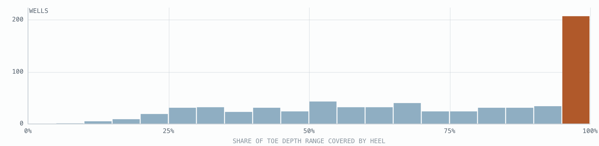
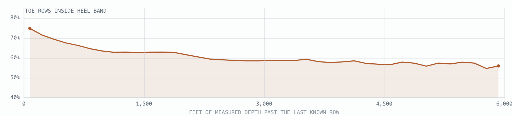
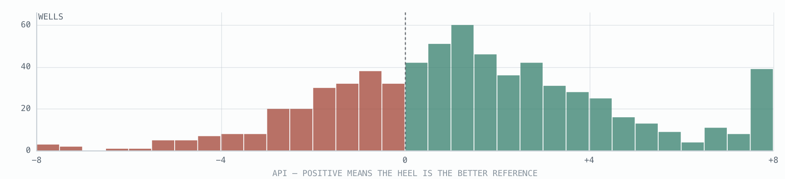
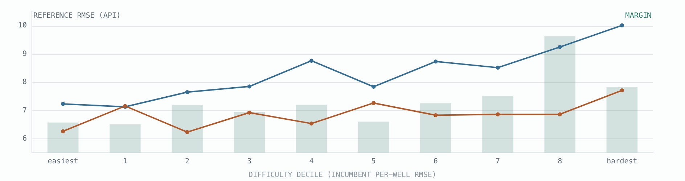
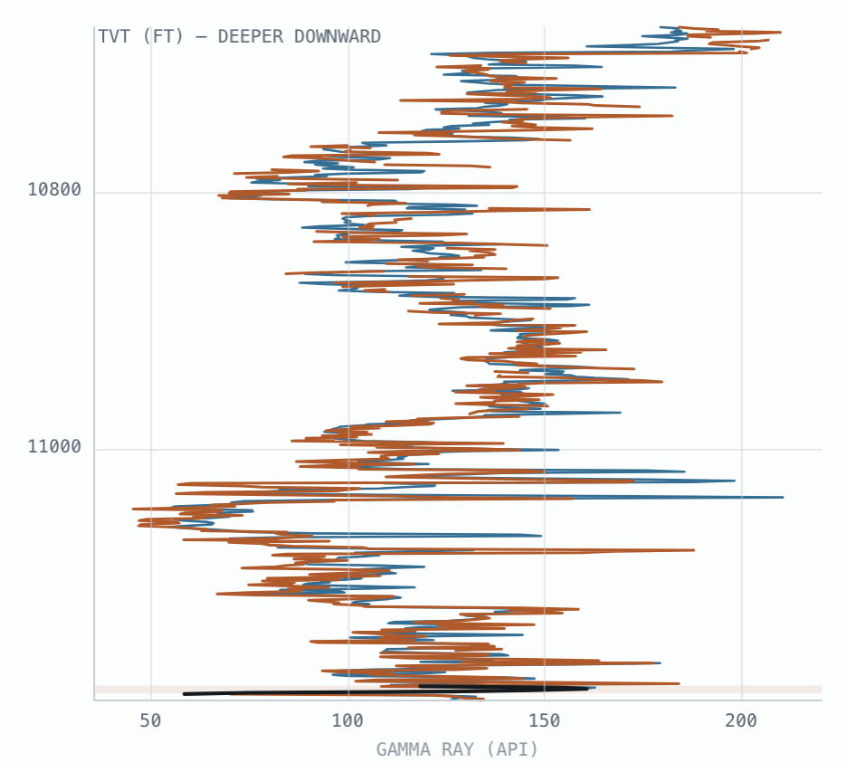
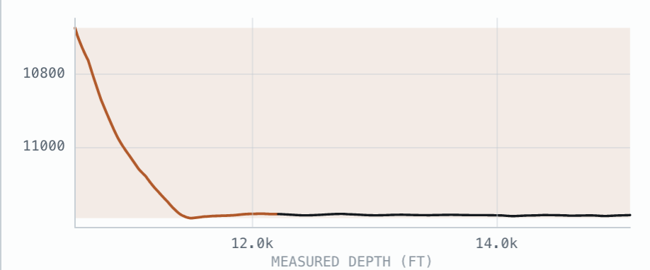
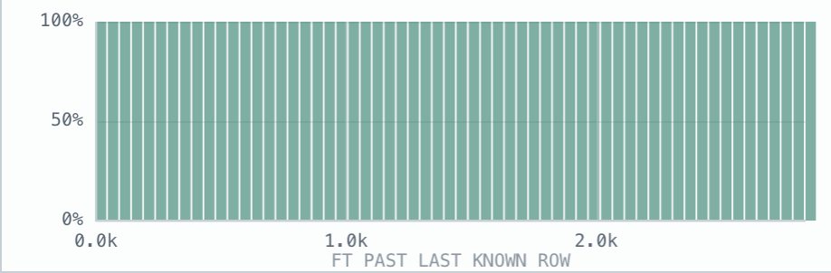
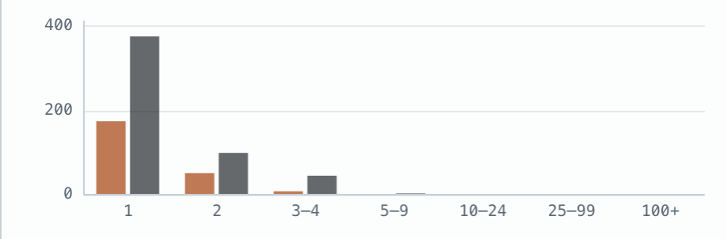
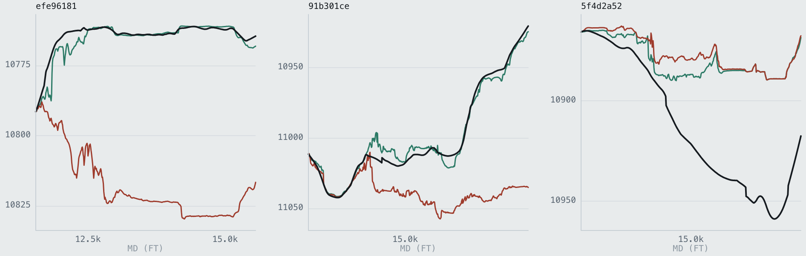

# The heel is a better barcode than the typewell — and that did not convert into score

*Reference diagnostics · 773 training wells · 2026-07-25*

Every well carries two candidate references for reading its own stratigraphy: the **typewell**
supplied with the data, and the **heel** — the section the bit already drilled through on the way
down, whose depths are known. Scored on identical depth bins across 773 wells, the heel is the
better reference in **68.5%** of them, and its margin grows with how hard the well is. That much
is solid.

Turning it into pooled RMSE is a different question, and the honest answer is **no — not by
splicing the two references together for every well**. This page maps the overlap, then shows how
a six-well test manufactures a spectacular result that is already known to evaporate out of
sample.

> **Terms used here.** *Heel* = the surveyed early section of the horizontal well, where the
> answer is known. *Toe* = the later section to be predicted. *Typewell* = the vertical reference
> log supplied with the competition data. *TVT* = true vertical thickness, the target: position
> inside the rock layers. *API* = the unit gamma ray is measured in.

## What overlaps, and in which coordinate

Heel and toe never overlap in measured depth — they are consecutive stretches of one borehole.
They overlap in TVT, the stratigraphic coordinate, because the heel sweeps *down through* the
layer cake while landing, and the toe then wanders *inside* a slice of that same cake. Wherever
the toe's true TVT falls in a band the heel already logged, the heel holds a gamma-ray reading for
that exact rock — measured by the same tool, in the same hole, hours earlier.

| how much of the toe the heel can speak to | |
|---|---|
| median share of the toe's depth range the heel logged | **73%** |
| wells where the heel covers the toe end to end | **31%** (207 wells) |
| wells with no usable overlap at all | **100** |
| heel GR samples per foot of TVT in the overlap | **23** |

### Coverage of the toe by the heel — 773 wells

Share of the toe's 1-ft TVT bins for which the heel holds at least one gamma-ray sample. The
distribution is strongly bimodal: a quarter of wells are below half coverage, while the single
largest group is pinned at 100%.

*Bar at the far right = 207 wells with complete coverage. The 100 wells with no overlap whatsoever
are excluded from this axis and counted separately.*

### Where along the toe the coverage runs out

Averaged over all wells: the probability that a toe row's true TVT still sits inside the heel's
logged band, as a function of how far past the last known row it is.

*Coverage is highest right where the toe begins (75%) and decays to 58% by 4,500 ft out — most of
the loss happens inside the first 1,500 ft, then it flattens. The heel helps most exactly where
the filter is still healthy, and least where it has already drifted.*

## Which reference actually predicts the toe's gamma ray?

The honest test: take only the depth bins where the toe has a GR reading *and* the heel has one
*and* the typewell spans — then ask each reference to reproduce the toe's GR at that depth. Same
bins, same rows, no home-field advantage. The mask is not a detail: two reasonable-looking choices
of which bins to score put the same margin at 0.40 API and at 1.22 API — a factor of three, with
the mismatched version *understating* the heel. Everything below is the identical-bin number.

| scored on identical bins, 773 wells | |
|---|---|
| heel → toe median RMSE | **6.77 API** |
| typewell → toe median RMSE | **8.38 API** |
| wells where the heel is the better reference | **68.5%** |
| median margin in the heel's favour | **+1.22 API** |

### Per-well margin — typewell RMSE minus heel RMSE

*Right of zero, the well's own heel is the better gamma-ray reference. The mass is clearly
right-shifted, but the left tail is real: in about three wells in ten the typewell still wins.*

### Reference error by well difficulty

Wells sorted into deciles by the incumbent pipeline's per-well RMSE. The heel's reference error is
essentially flat across difficulty; the typewell's degrades steadily. The three series plotted are
heel → toe, typewell → toe, and the margin between them.

*This is the load-bearing chart. Hard wells are not hard because their heel stops describing them
— they are hard because *the typewell does*. In the hardest two deciles the typewell drifts to
9–10 API of reference error while the heel stays near 7.*

> **The gate that doesn't work.** The obvious way to pick a reference per well without labels is
> to measure how far the heel and typewell disagree where both exist, and trust the heel when they
> diverge. That statistic is legal on hidden wells — and it is nearly useless: Spearman ρ = 0.08
> against the true margin. Disagreement tells you the two references differ, not which one is
> right.

## Gaps and sampling rate

Gamma ray is recorded on the 1-ft measured-depth grid but is missing from a large share of rows —
and the two sections are not missing it equally.

| property (median over 773 wells) | heel | toe | ratio |
|---|---|---|---|
| GR present, share of 1-ft rows | 79.7% | 69.7% | 1.14× |
| TVT traversed per GR sample (ft) | 0.45 | 0.02 | 27× |
| separate dropouts per well | ~764 | ~764 | 1× |
| longest dropout (ft) | 9 | 11 | 1× |
| GR samples per ft of TVT, overlap band | 23 | — | vs 2 for the typewell |

The dropouts themselves are benign and near-identical in both sections: about a thousand separate
outages per well, almost all one to three feet long, worst case around 11 ft. These are
decimation, not lost intervals — linear interpolation across them is safe, and the filter already
depends on it.

> **Sampling rate is where the two sections genuinely differ.** Per gamma-ray sample the heel
> traverses roughly **27×** more TVT than the toe does. The toe creeps through 0.02 ft of
> stratigraphy between readings; the heel cuts 0.45 ft. So in the overlap band the heel delivers
> ~23 samples per foot of TVT against the typewell's 2 — a vertically *finer* reference, bought at
> the price of being noisier per sample and covering less ground.

## Three easy wells, three hard ones

Picked by the incumbent pipeline's per-well RMSE, restricted to wells with a normal-sized
prediction zone. The log strip reads the way a geologist would read it: gamma ray across, depth
increasing downward, the overlap band shaded. Four series are plotted — the toe's own GR (the
truth being matched), the heel, the typewell, and the shaded overlap band.

### Log strip — GR against TVT

### Trajectory — TVT against measured depth

*Shaded band = the TVT interval the heel logged. Where the ink trace leaves the band, the heel has
nothing to say about that rock.*

### Coverage along the toe

### GR dropout lengths (ft), heel against toe

| well | tier | filter RMSE | coverage | r heel→toe | r typewell→toe | RMSE heel | RMSE typewell | GR rate heel | GR rate toe |
|---|---|---:|---:|---:|---:|---:|---:|---:|---:|
| `25fd32b3` | easy | 1.02 | 100% | 0.986 | 0.963 | **5.0** | 9.2 | 82% | 74% |
| `af7a59ce` | easy | 1.16 | 98% | 0.992 | 0.907 | **3.7** | 10.4 | 81% | 71% |
| `d24ff243` | easy | 1.27 | 83% | 0.979 | 0.831 | **3.5** | 8.9 | 86% | 74% |
| `efe96181` | hard | 47.53 | 100% | 0.871 | 0.632 | **6.4** | 14.1 | 78% | 83% |
| `91b301ce` | hard | 41.71 | 100% | 0.732 | 0.671 | **9.4** | 11.0 | 88% | 85% |
| `5f4d2a52` | hard | 45.44 | 27% | 0.635 | 0.205 | **5.4** | 9.7 | 91% | 78% |

Correlation and RMSE computed on the overlap band only, in 1-ft TVT bins. Bold = the better of the
two references for that well; the heel wins all six. *Coverage* is the share of toe rows whose
true TVT falls inside the band the heel logged.

## Does the particle filter care?

Five arms on the same six wells, differing only in what gamma-ray curve the likelihood matches
against and how dropouts are handled. 128-seed likelihood-weighted ensemble, 500 particles,
identical seeds across arms. The likelihood's noise scale is pinned to the unspliced typewell in
every arm — otherwise a smoother reference quietly buys itself a sharper likelihood and the
comparison measures the wrong thing.

| arm | `25fd32b3` | `af7a59ce` | `d24ff243` | `efe96181` | `91b301ce` | `5f4d2a52` | easy | hard | pooled |
|---|---:|---:|---:|---:|---:|---:|---:|---:|---:|
| base — typewell only | 1.12 | 0.71 | 1.72 | 55.57 | 52.14 | 43.73 | 1.38 | 50.46 | 38.36 |
| no gap fill — skip missing GR | 1.69 | 1.17 | 1.77 | 55.28 | 50.99 | 44.04 | 1.61 | 49.97 | 38.00 |
| **splice 0.70 — heel blended in** | 1.30 | 1.03 | 1.75 | **2.96** | **5.02** | 41.56 | 1.48 | 24.16 | **18.39** |
| average 0.50 — heel and typewell | 1.34 | 1.00 | 1.78 | 47.63 | 8.02 | 44.01 | 1.50 | 35.25 | 26.82 |
| replace 1.00 — heel where it covers | 1.27 | 1.12 | 2.31 | 3.63 | 29.07 | 39.39 | 1.83 | 29.45 | 22.42 |

Pooled row RMSE in feet. The pooled column looks like a 2× improvement. It is not — read the two
notes below before believing it.

> **Read the easy and hard columns as different experiments.** Three of these six wells were
> picked from the worst decile, so the pooled column is not an estimate of anything field-wide —
> it is dominated by two rescues. The easy-well column is the one that generalises, and it goes
> the other way.

> **On hard wells this is a mode-lock test, not a smooth error measurement.** The filter is
> bimodal: it either holds the right layer or loses it and runs tens of feet off. Arm differences
> there are mostly about which reference lets the seed ensemble lock the correct mode — the 0.50
> average is visibly unstable across seed counts for that reason, while the 0.70 splice locks
> reliably on both of the two worst wells. Treat the easy-well column as the precision measurement
> and the hard-well column as a pass/fail.

*Truth (black), the unspliced base (red) and the 0.70 heel splice (green) on three of the six
wells. On `efe96181` and `91b301ce` the splice tracks the truth where the base has locked onto the
wrong layer; on `5f4d2a52` both sit on the same wrong mode and the splice buys nothing.*

> **What cannot be done, and why.** The natural reading of "augment the lateral GR series with the
> heel" is to overwrite or average the toe's own GR readings using heel values at matching depth.
> That is circular: selecting the heel value requires knowing the toe row's TVT, which is the
> prediction target. Doing it anyway makes the likelihood constant and the filter blind. Every arm
> above therefore augments the *reference* — the curve the observations are matched against —
> which needs only the heel's own known TVT, and is legal on hidden wells.

## So — use the heel?

### The reference finding is real. The RMSE win is not.

This experiment is exactly how you would fool yourself into believing otherwise.

A 0.70-weight heel splice was screened on 140 wells at **pooled 9.3441, −0.560**, then failed
confirmation on 260 wells never seen during the screen — and failed monotonically, worse with
every increase in splice weight: **+0.091** at weight 0.40, **+0.439** at 0.70, **+0.624** at
1.00. On those fresh wells the five biggest rescues were worth −47.6 ft while the other 255 wells
cost **+122.1 ft**. The direction is closed.

The six-well table above is that same artifact rebuilt from scratch. Three of the six were
selected from the worst decile, so the pooled figure is carried entirely by two catastrophic
rescues — while the easy wells, where most of the field lives, got *worse*: 1.375 → 1.479 ft. A
tail-driven pooled gain on a hand-picked sample is not evidence of anything except the sampling.

### What survives

- The heel is genuinely the better reference — 68.5% of wells, +1.22 API median, identical bins,
  all 773. This is not the contested claim; the contested claim is that it converts into RMSE.

- Its advantage is concentrated in hard wells (~0.8 API in the easiest decile, ~3.0 in the eighth)
  and the reason is that the typewell degrades there while the heel stays flat. That is a fact
  about where the incumbent's reference fails, and it is worth keeping whatever happens to the
  splice.

- Coverage, not fidelity, is the binding constraint. The heel has no data over 27% of the toe's
  depth range in the median well and none at all in 100 wells, so a heel-based reference is
  partial by construction.

- Coverage decays along the toe — 75% at the start, 58% by 4,500 ft. Help is front-loaded; the far
  tail stays the typewell's problem.

### The one thing that would change the answer

The splice does not fail because it is wrong. It fails because it is applied everywhere — paid for
by the many to rescue the few. It becomes viable only with a **router that names the rescue wells
in advance** from something computable on hidden wells. The cheapest candidate is already dead:
heel/typewell disagreement, which sounds like precisely the right signal, correlates with the true
reference margin at **ρ = 0.08**. Until a router clears that bar, further splice-weight sweeps
will keep reproducing the same screen-then-evaporate cycle.

### Do not re-run

- Filling lateral GR gaps from the heel. Circular — choosing the heel value requires the toe row's
  TVT, which is the target. Linear interpolation is the right tool and already earns its keep:
  removing it costs +0.24 ft on the easy wells here.

- Calibrating lateral GR onto the typewell. Closed — the heel-fitted affine map drifts heel→toe
  (\|gain drift\| median 0.215), cost +1.55 ft.

- Pooling donor heels from neighbouring wells. Closed and monotonically harmful (+1.745 to
  +2.417).

- Global splice-weight sweeps. Closed above. Only routing is open.

> **A note on record-keeping.** This closure was written up in the experiment log but not added to
> the short list of closed directions that gets re-read at the start of every session. That gap is
> exactly how a dead direction gets re-opened months later, and it cost me a repeat of this work.

**Sources.** All 773 training wells, horizontal and typewell logs as supplied. Difficulty deciles
come from the incumbent pipeline's per-well RMSE. Ground-truth TVT is used to *score* the
references and the filter arms — that is diagnostic only; every construction actually fed to the
filter uses the heel's own known TVT and nothing from the prediction zone.
